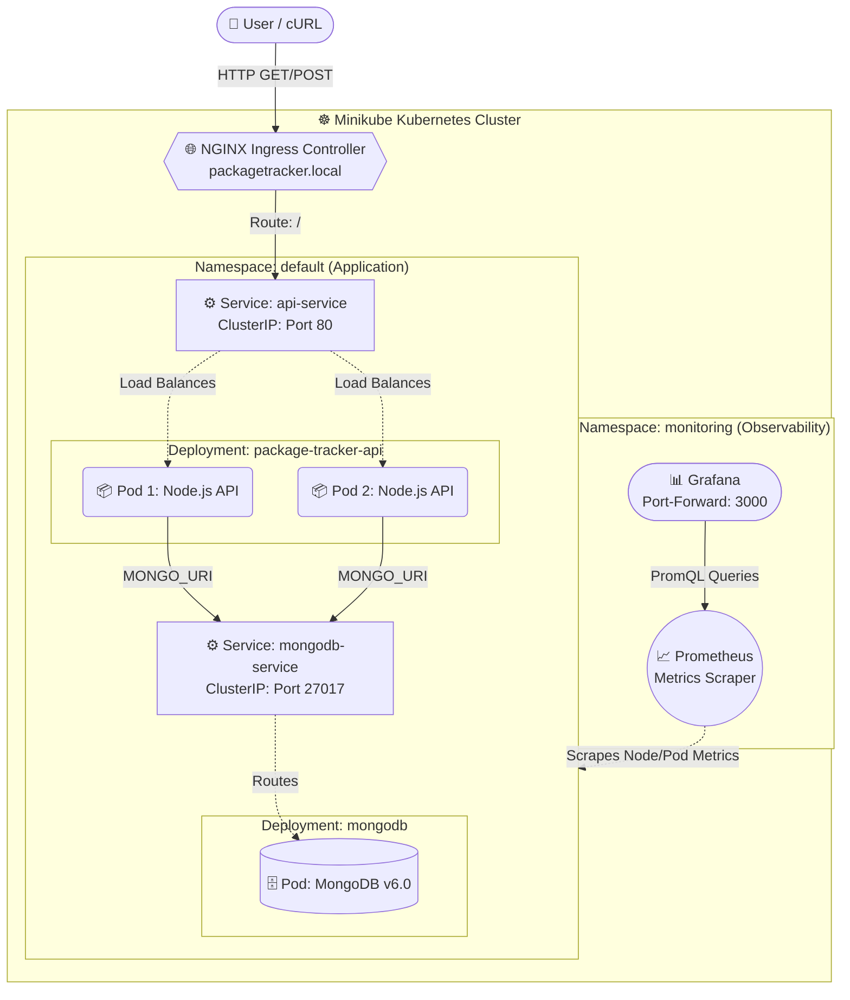

# K8s Microservices Package Tracker (Cloud Native Architecture)


A highly available, two-tier microservices architecture deployed on Kubernetes using a custom Helm chart. This project demonstrates modern DevOps and Site Reliability Engineering (SRE) practices, including infrastructure templating, Zero-Downtime deployments, local Ingress routing, and enterprise-grade observability.

## ️Architecture Overview


- **Compute Tier (API):** A containerized Node.js/Express REST API. Configured with explicit Kubernetes CPU/Memory resource limits and HTTP readiness/liveness probes.
- **Stateful Tier (Database):** A MongoDB container managed via Kubernetes Deployments and internal ClusterIP services.
- **Networking Tier (Ingress):** NGINX Ingress Controller routing local host traffic into the cluster safely.
- **Observability Tier:** Integration with the `kube-prometheus-stack` to scrape metrics and visualize real-time resource consumption in Grafana.

---

## Quick Start & Deployment Guide

### Prerequisites
Ensure you have the following installed on your machine:
- `docker`
- `kubectl`
- `minikube`
- `helm`

### 1. Initialize the Cluster
Start Minikube and explicitly enable the NGINX Ingress addon:
```bash
minikube start --addons=ingress
```

### 2. Build the Application Image
Instead of pushing to a remote registry, point your local terminal to Minikube's internal Docker daemon to build the API image directly into the cluster:
```bash
eval $(minikube docker-env)
cd app
docker build -t package-tracker-api:v1 .
cd ..
```

### 3. Deploy Infrastructure via Helm
Deploy the custom Helm chart to provision the database, API deployments, services, and ingress routing:
```bash
helm install my-package-tracker ./helm-chart
```
*Verify the pods are running:* `kubectl get pods -w`

### 4. Configure Local DNS
Map the local domain to your Minikube cluster IP:
```bash
echo "$(minikube ip) packagetracker.local" | sudo tee -a /etc/hosts
```

---

## API Usage

The API is now exposed securely through the Kubernetes Ingress Controller.

**Add a new package (POST):**
```bash
curl -X POST http://packagetracker.local/api/packages \
-H "Content-Type: application/json" \
-d '{"name": "htop", "manager": "zypper", "description": "Interactive process viewer"}'
```

**Retrieve all packages (GET):**
```bash
curl http://packagetracker.local/api/packages
```

---

## Enterprise Observability (Prometheus & Grafana)

This infrastructure integrates with the Prometheus monitoring stack to provide real-time metrics on pod health, CPU/Memory limits, and network requests.

**1. Deploy the Monitoring Stack:**
```bash
helm repo add prometheus-community https://prometheus-community.github.io/helm-charts
helm repo update
helm install monitoring prometheus-community/kube-prometheus-stack --namespace monitoring --create-namespace
```

**2. Access the Grafana Dashboard:**
Extract the dynamically generated admin password:
```bash
kubectl get secret --namespace monitoring monitoring-grafana -o jsonpath="{.data.admin-password}" | base64 --decode ; echo
```

Port-forward Grafana to your local machine:
```bash
kubectl port-forward svc/monitoring-grafana -n monitoring 3000:80
```
Open `http://localhost:3000` in your browser (Username: `admin`). Navigate to **Dashboards -> Kubernetes / Compute Resources / Namespace (Pods)** to view live utilization metrics for the `default` namespace.

---

## Cleanup
To tear down the infrastructure and conserve local resources:
```bash
helm uninstall my-package-tracker
helm uninstall monitoring -n monitoring
minikube stop
```
