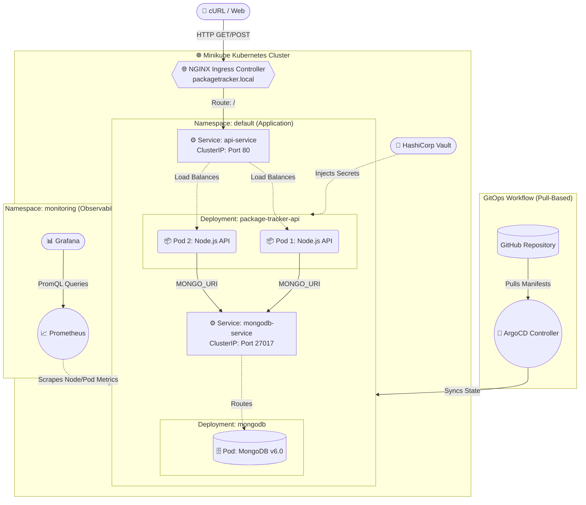

# K8s Microservices Package Tracker | GitOps & DevSecOps Architecture ☸️

[](https://kubernetes.io/)
[](https://argoproj.github.io/cd/)
[](https://www.vaultproject.io/)
[](https://helm.sh/)
[](https://prometheus.io/)
[](https://grafana.com/)

A highly available, two-tier microservices architecture deployed on Kubernetes using strict **GitOps principles**. This project demonstrates modern Platform Engineering and Site Reliability Engineering (SRE) practices, including automated reconciliation via ArgoCD, dynamic secret injection via HashiCorp Vault, Zero-Downtime deployments, and enterprise-grade observability.

## Architecture & GitOps Flow


```mermaid
flowchart TB
    subgraph GitOps ["GitOps Workflow (Pull-Based)"]
        Repo[(GitHub Repository)] -->|Pulls Manifests| ArgoCD((🐙 ArgoCD Controller))
    end
    
    subgraph Cluster ["☸ Minikube Kubernetes Cluster"]
        ArgoCD -->|Syncs State| NS_Default
        Ingress{{🌐 NGINX Ingress Controller<br/>packagetracker.local}}
        Vault([🔐 HashiCorp Vault]) -.->|Injects Secrets| API_Deploy
        
        subgraph NS_Default ["Namespace: default (Application)"]
            direction TB
            API_SVC[⚙ Service: api-service<br/>ClusterIP: Port 80]
            DB_SVC[⚙ Service: mongodb-service<br/>ClusterIP: Port 27017]
            
            subgraph API_Deploy ["Deployment: package-tracker-api"]
                API_Pod1(📦 Pod 1: Node.js API)
                API_Pod2(📦 Pod 2: Node.js API)
            end
            
            subgraph DB_Deploy ["Deployment: mongodb"]
                DB_Pod[(🗄 Pod: MongoDB v6.0)]
            end
        end
        
        subgraph NS_Monitor ["Namespace: monitoring (Observability)"]
            Prometheus((📈 Prometheus))
            Grafana([📊 Grafana])
        end
    end

    %% Network Traffic Flow
    User([👤 cURL / Web]) -- "HTTP GET/POST" --> Ingress
    Ingress -- "Route: /" --> API_SVC
    API_SVC -. "Load Balances" .-> API_Pod1 & API_Pod2
    API_Pod1 & API_Pod2 -- "MONGO_URI" --> DB_SVC
    DB_SVC -. "Routes" .-> DB_Pod

    %% Observability Flow
    Prometheus -. "Scrapes Node/Pod Metrics" .-> NS_Default
    Grafana -- "PromQL Queries" --> Prometheus

```

* **GitOps Controller (ArgoCD):** ArgoCD continuously monitors this repository and automatically synchronizes the cluster state with the `main` branch.
* **Secret Management (HashiCorp Vault):** MongoDB credentials are no longer hardcoded as plain-text environment variables. They are securely injected into the Kubernetes cluster deployment via Vault secrets.
* **Compute Tier (API):** A containerized Node.js/Express REST API running as a non-root user. Configured with explicit CPU/Memory limits and HTTP readiness/liveness probes to enforce zero-downtime rolling upgrades.
* **Observability Tier:** Integration with the `kube-prometheus-stack` to scrape metrics and visualize real-time resource consumption in Grafana.

---
## Engineering Challenges Overcome

Migrating from imperative Helm deployments to a declarative GitOps workflow surfaced several architectural challenges that required SRE-level troubleshooting:

* **Stateful Pod Initialization Race Conditions:** During automated ArgoCD syncs, the Node.js API pods were initializing faster than the MongoDB stateful backend, resulting in `CrashLoopBackOff` errors. **Solution:** Engineered strict HTTP `readinessProbe` and `livenessProbe` configurations in the API Helm chart with tuned `initialDelaySeconds` (15s) and `periodSeconds` (20s) to guarantee the database connection string resolved before the API began serving Ingress traffic.
* **GitOps Secret Anti-Patterns:** A pull-based GitOps workflow means the repository is the single source of truth. However, storing the MongoDB connection URI in plain-text inside the `values.yaml` violated security compliance. **Solution:** Extracted hardcoded `env` variables and implemented a Kubernetes `Secret` manifest (`secret.yaml`), injecting the encoded payload into the deployment via `secretKeyRef`. This decoupled configuration from code and laid the groundwork for the HashiCorp Vault injector.
* **ArgoCD Out-of-Sync Drift:** Initial manual `helm install` tests left residual state in the cluster. When ArgoCD was introduced, it detected an `OutOfSync` state and refused to overwrite the existing resources. **Solution:** Configured the `syncPolicy` in `application.yaml` with automated `prune: true` and `selfHeal: true` directives, allowing the ArgoCD controller to ruthlessly enforce the Git repository state and eliminate cluster drift.

---
## Quick Start & GitOps Deployment Guide

### Prerequisites

* `docker` & `kubectl`
* `minikube` (with Ingress addon enabled)
* `helm`

### 1. Initialize Cluster & Build Image

Start Minikube and build the API image directly into the cluster's internal Docker daemon:

```bash
minikube start --addons=ingress
eval $(minikube docker-env)
cd app
docker build -t package-tracker-api:v1 .
cd ..

```

### 2. Configure HashiCorp Vault Secrets

To ensure security compliance, deploy the base64-encoded Vault configurations:

```bash
kubectl apply -f helm-chart/templates/secret.yaml

```

### 3. Deploy Infrastructure via GitOps (ArgoCD)

This project utilizes a pull-based GitOps workflow. Install ArgoCD and apply the declarative application manifest to automatically synchronize the cluster with this repository:

```bash
# Install ArgoCD into the cluster
kubectl create namespace argocd
kubectl apply -n argocd -f [https://raw.githubusercontent.com/argoproj/argo-cd/stable/manifests/install.yaml](https://raw.githubusercontent.com/argoproj/argo-cd/stable/manifests/install.yaml)

# Wait for ArgoCD server to spin up, then deploy the Application
kubectl apply -f application.yaml

```

*Verify synchronization status:* `kubectl get application package-tracker -n argocd`

### 4. Configure Local DNS

Map the local domain to your Minikube cluster IP:

```bash
echo "$(minikube ip) packagetracker.local" | sudo tee -a /etc/hosts

```

---

## API Usage

The API is exposed securely through the Kubernetes Ingress Controller.

**Add a new package (POST):**

```bash
curl -X POST [http://packagetracker.local/api/packages](http://packagetracker.local/api/packages) \
-H "Content-Type: application/json" \
-d '{"name": "htop", "manager": "zypper", "description": "Interactive process viewer"}'

```

**Retrieve all packages (GET):**

```bash
curl [http://packagetracker.local/api/packages](http://packagetracker.local/api/packages)

```

---

## Enterprise Observability (Prometheus & Grafana)

**1. Deploy the Monitoring Stack:**

```bash
helm repo add prometheus-community [https://prometheus-community.github.io/helm-charts](https://prometheus-community.github.io/helm-charts)
helm repo update
helm install monitoring prometheus-community/kube-prometheus-stack --namespace monitoring --create-namespace

```

**2. Access the Grafana Dashboard:**
Extract the dynamically generated admin password:

```bash
kubectl get secret --namespace monitoring monitoring-grafana -o jsonpath="{.data.admin-password}" | base64 --decode ; echo

```

Port-forward Grafana to your local machine:

```bash
kubectl port-forward svc/monitoring-grafana -n monitoring 3000:80

```

Open `http://localhost:3000` in your browser (Username: `admin`). Navigate to **Dashboards -> Kubernetes / Compute Resources / Namespace (Pods)** to view live utilization metrics for the `default` namespace.

---

## Cleanup

```bash
kubectl delete -f application.yaml
helm uninstall monitoring -n monitoring
minikube stop

```
